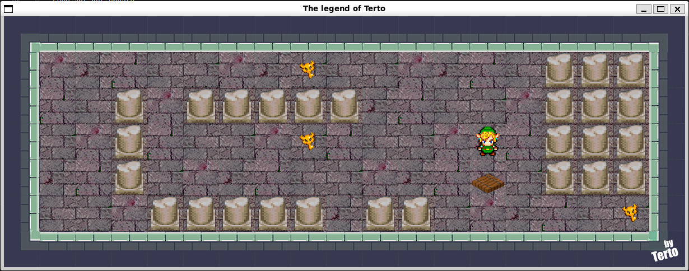
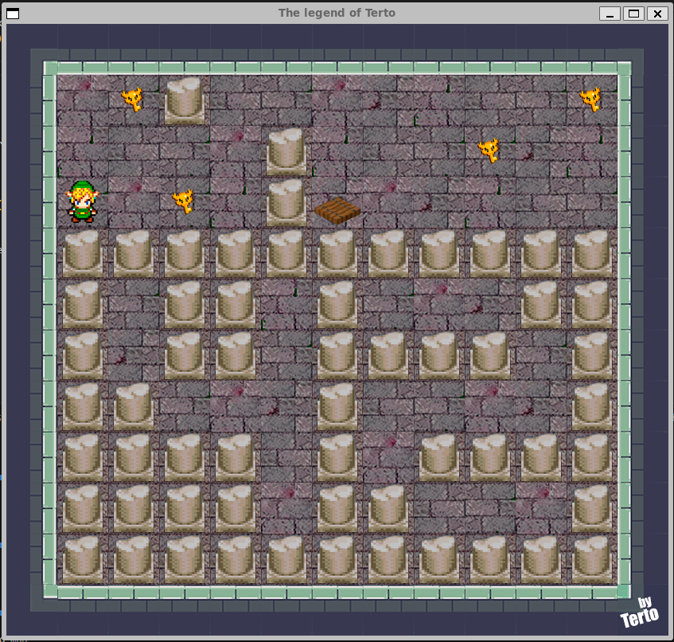

# 🎮 so_long – 42 School Project
Pequeño juego 2D desarrollado en C como parte del currículo de 42 School, utilizando la librería gráfica MLX42 para renderizado, manejo de eventos y gestión de ventanas.

El objetivo es simple: recoger todos los coleccionables del mapa y alcanzar la salida.


# 🧩 Características
Parsing de mapas .ber
Validación completa del mapa (forma, muros, elementos obligatorios)
Comprobación de accesibilidad (path checking)
Renderizado 2D con MLX42
Gestión de texturas
Control de movimientos por teclado
Contador de movimientos en tiempo real
Gestión correcta de memoria (sin leaks)
Sistema de compilación automático (descarga MLX42 si no existe)
Compatible con Linux y WSL


# 📸 Vista del Proyecto



```bash
📂 Estructura del Proyecto
└── 42-So-long
    ├── images
    │   ├── show1.png
    │   └── show2.png
    ├── maps
    ├── src
    ├── Makefile
    └── README.md
```

# ⚙️ Requisitos
Linux o WSL2
gcc
make
cmake
Librerías OpenGL y GLFW

# 🐧 Instalación de dependencias (Ubuntu / WSL)

make winstall

O manualmente:
sudo apt update
sudo apt install -y cmake libgl-dev libglx-dev libglu-dev \
libxrandr-dev libxinerama-dev libxcursor-dev libxi-dev \
libglfw3-dev build-essential


# 🚀 Instalación y Ejecución

## Clonar repositorio
git clone https://github.com/TU_USUARIO/42-So-long.git
cd 42-So-long

## Compilar proyecto
make

## Ejecutar el juego
./so_long maps/map.ber
🔄 Comandos útiles

## Recompilar todo
make re

## Limpiar binarios
make clean

## Limpieza completa (incluye cache de MLX42)
make fclean

## Ejecutar con valgrind
make valgrind maps/map.ber
🗺️ Formato del Mapa

Ejemplo válido:
```bash
1111111
1P0C001
1000001
1C000E1
1111111
```

Leyenda
```bash
1 → Muro
0 → Espacio vacío
P → Jugador
C → Coleccionable
E → Salida
```

# 🛠 Sistema de Build
MLX42 se descarga automáticamente.
Se compila en ~/.cache/mlx42 para evitar problemas con rutas con espacios.
No requiere instalación manual de la librería.

# 👨‍💻 Autor
Proyecto desarrollado como parte del cursus de 42.